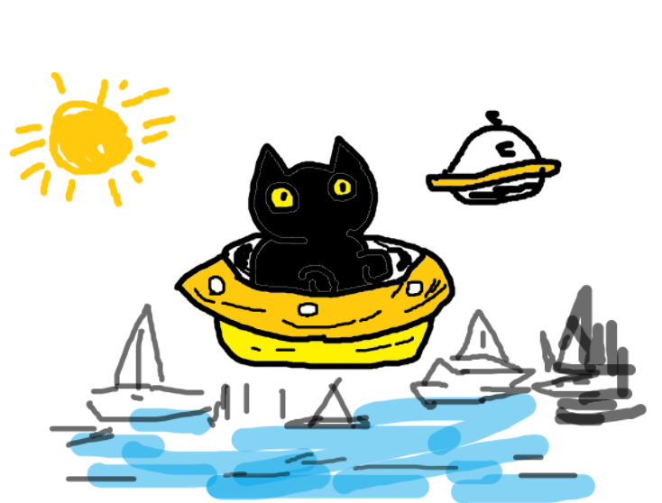

# Multimodal LLM Evaluation
## Qwen3-VL と OpenAI による画像理解性能の比較

ローカル環境で動作する **Qwen3-VL** と、クラウドAPIで利用する **OpenAIのマルチモーダルモデル** に対して、同一画像・同一プロンプトを入力し、画像理解の違いを比較した検証プロジェクトです。

単純に回答を見比べるだけではなく、

- Ground Truthの作成
- LLM-as-a-Judgeによる一次評価
- 評価結果のレビュー
- Atomic Factへの正規化
- Precision / Recall / F1-scoreによる定量評価
- Ground Truthを設定しない定性比較

までを一連の評価パイプラインとして構築しました。

---

## 1. 検証目的

本検証の目的は、各モデルを個別に最適化することではありません。

> **同一の画像・同一のプロンプトを使用し、可能な限り条件を揃えた状態で画像理解の違いを比較すること**

を目的としています。

そのため、モデルごとの追加チューニングやプロンプト最適化は原則として行わず、誤認・見落とし・部分的な認識も比較結果として扱いました。

---

## 2. 評価結果

定量評価には5枚の画像から作成した **47個のAtomic Fact** を使用しました。

| Model | MATCH | PARTIAL | MISS | Precision | Recall | F1-score |
| --- | ---: | ---: | ---: | ---: | ---: | ---: |
| Qwen3-VL | 57.4% | 25.5% | 17.0% | 0.659 | 0.574 | 0.614 |
| OpenAI | 74.5% | 12.8% | 12.8% | 0.833 | 0.745 | 0.787 |

本評価セットでは、OpenAIがPrecision、Recall、F1-scoreのすべてで高い結果となりました。

一方、Qwen3-VLでは `MISS` より `PARTIAL` の割合が高く、

> **対象や場面の大意は認識できているが、数量・種類・属性・配置などの詳細が不足する**

ケースが比較的多く確認されました。

なお、この数値は本プロジェクト独自の小規模評価セットによるものであり、各モデルの一般的な性能を示すベンチマーク値ではありません。

---

## 3. 評価画像

定量評価には `001.png` ～ `005.png` の5枚を使用しました。

複数の観点を確認できるよう、以下の要素を含む画像を用意しています。

- 複数物体の認識
- 物体同士の位置関係
- 背景の理解
- OCR
- 画像全体の意味・種類

### 定量評価画像の例：001.png



`001.png` では、猫・UFO・ヨット・太陽など複数の対象と、それらの位置関係を評価しています。

この画像では、Qwen3-VLがGround Truth上の **「UFO」** を **「宇宙船」** と表現するなど、対象の大意は捉えているものの具体性に差が生じる例も確認できました。

---

### 定性比較画像：000.png


`000.png` はStable Diffusionで生成した通常のイラストです。

この画像にはGround Truthを設定せず、両モデルが自然な画像に対してどのような説明を行うかを比較する **定性評価** に使用しました。

---

## 4. 使用モデル

### 画像理解モデル

#### Qwen3-VL

- Model: `Qwen/Qwen3-VL-4B-Instruct`
- ローカル環境で実行
- Hugging Face Transformersを使用

#### OpenAI

- Model: `gpt-5.6-terra`
- OpenAI API経由で実行

### Judge LLM

- Model: `gpt-5.6-sol`

Judge LLMは画像そのものを見るのではなく、

- Ground Truth
- Qwen3-VLの回答
- OpenAIの回答

を比較し、一致・部分一致・欠落・追加情報などを一次評価するために使用しました。

---

## 5. 共通プロンプト

Qwen3-VLとOpenAIには、同一のプロンプトを使用しています。

評価項目は以下の5項目です。

1. 主な対象
2. 対象同士の関係・配置
3. 背景・周囲
4. 画像内の文字
5. 画像全体の意味・種類

Ground Truthは画像理解モデルには与えていません。

---

## 6. 評価フロー

本検証では、以下の流れで評価を行いました。

```text
評価画像
   │
   ├── Qwen3-VL
   │
   └── OpenAI
          │
          ▼
    画像理解結果を固定
          │
          ▼
      Judge LLM
          │
          │ Ground Truthとの
          │ 一致・差異を一次評価
          ▼
     評価結果をレビュー
          │
          │ 粒度・重複・
          │ 判定基準を確認
          ▼
 Ground TruthをAtomic Fact化
          │
          ▼
 MATCH / PARTIAL / MISS
          │
          ▼
 TP / FP / FNへ変換
          │
          ▼
 Precision / Recall / F1-score
          │
          ▼
        最終比較
```

ここで重要なのは、**Judge LLMの段階ではF1-scoreを算出していない**ことです。

Judge LLMはGround Truthとモデル回答の意味的な一致・差異を分類する一次評価を担当します。

その結果を参考に評価粒度を整理し、Atomic Fact単位の最終ラベルを固定した後で、Precision / Recall / F1-scoreを算出しています。

---

## 7. LLM-as-a-Judgeによる一次評価

Judge LLMでは、モデル回答とGround Truthを比較し、以下のカテゴリへ分類しました。

### Ground Truth側

- `matched`
  - Ground Truthと十分一致している情報

- `partial`
  - 意味は近いが、数量・属性・種類・配置などに差がある情報

- `missed`
  - Ground Truthに存在するが、モデルが取得できていない情報

### モデルが追加した情報

- `unsupported`
  - Ground Truthと明確に矛盾する、または明確な誤認

- `unverified`
  - Ground Truthには存在しないが、Ground Truthだけでは正誤を判断できない追加情報

Ground Truthは画像内の情報を完全に列挙したものではありません。

そのため、Ground Truthに記載されていないという理由だけで誤答とはせず、`unsupported` と `unverified` を分離しました。

---

## 8. 評価結果のレビュー

LLM-as-a-Judgeは意味比較には有効でしたが、評価する事実の粒度に揺れが生じるケースがありました。

例えば、

- 同じ事実が `partial` と `missed` の両方に含まれる
- 1つの事実が複数の評価単位に分割される
- Ground Truthにない追加情報の扱いが一定しない

といったケースです。

そのため、Judge LLMの結果をそのままF1-scoreへ変換せず、Ground Truthと固定済みLLM出力を照合しながらレビューし、評価基準を整理しました。

Notebookでは代表例のみを表示しています。

### レビュー例

| Model / Image | Ground Truth（Atomic Fact） | 固定済みLLM出力 | 一致した点 | 差異 | 最終判定 |
| --- | --- | --- | --- | --- | --- |
| Qwen3-VL / 001.png | 黄色いUFOが描かれている | 1. 黒い猫が黄色い宇宙船に乗っている。 | 黄色い飛行物体を認識している | Ground Truthの「UFO」を「宇宙船」と表現している | PARTIAL |
| Qwen3-VL / 002.png | 犬が小さな船の上に立っている | 2. 対象同士の関係・配置は、イルカが犬の前で顔を近づけ、犬はイルカを向いて立っている。 | 犬とイルカの存在・近い位置関係は捉えている | 犬が小さな船の上に立っている関係を認識していない | MISS |
| Qwen3-VL / 005.png | BUTTERFLYと表示されている | 4. 画像内の文字は「HUMAN」「DOG」「CAT」「BUTTER FLY」および蝶々のイラストに付随する記号。 | BUTTERFLYに相当する文字列を認識している | 「BUTTERFLY」を「BUTTER FLY」と空白入りで認識している | PARTIAL |
| Qwen3-VL / 005.png | 物体検知結果を模した図である | 5. 画像全体の意味・種類は、動物と人間のキャラクターを分類する図解である。 | 対象を識別・分類する図という大意は捉えている | 「物体検知結果を模した図」までは特定していない | PARTIAL |
| OpenAI / 002.png | 犬が小さな船の上に立っている | 2. 対象同士の関係・配置：子犬がイルカの背中付近に乗り、互いに鼻先を近づけています。 | 犬とイルカの近接関係は捉えている | Ground Truthでは犬は船上だが、イルカの背中付近にいると誤認している | MISS |

全件のレビュー済みJudge結果は以下に保存しています。

```text
results/judge_results_reviewed.json
```

---

## 9. Atomic Factへの正規化

Judge LLMの文章単位の評価をそのまま件数として扱うと、1項目に含まれる情報量の違いによって評価値が変化します。

そこでGround Truthを、より小さな意味単位である **Atomic Fact** に分解しました。

例えば `001.png` では、

```text
黒猫が描かれている
黄色いUFOが描かれている
黒猫が黄色いUFOに乗っている
右上に別のUFOがある
海が描かれている
海に複数のヨットが浮かんでいる
```

のように、個々の事実を独立した評価単位としています。

5枚の評価画像から、合計 **47個のAtomic Fact** を定義しました。

各Atomic Factについて、

- `MATCH`
- `PARTIAL`
- `MISS`

のいずれか1つへ最終分類しています。

Atomic Factと最終評価ラベルは以下に保存しています。

```text
results/final_evaluation.json
```

---

## 10. Precision / Recall / F1-score

### Precision

```text
Precision = TP / (TP + FP)
```

### Recall

```text
Recall = TP / (TP + FN)
```

### F1-score

```text
F1 = 2 × Precision × Recall / (Precision + Recall)
```

または、

```text
F1 = 2TP / (2TP + FP + FN)
```

と表せます。

### 本検証でのStrict評価

本検証では、`PARTIAL` を完全な正解とは扱わない独自のStrict評価を採用しました。

```text
MATCH       → TP
PARTIAL     → FP + FN
MISS        → FN
unsupported → FP
unverified  → 評価対象外
```

これは一般的なF1-scoreの分類ルールではなく、**本検証で採用した評価上のマッピングルール**です。

例えばQwen3-VLでは、

```text
MATCH       = 27
PARTIAL     = 12
MISS        = 8
unsupported = 2
```

となったため、

```text
TP = 27
FP = 12 + 2 = 14
FN = 12 + 8 = 20
```

となります。

その結果、

```text
Precision ≒ 0.659
Recall    ≒ 0.574
F1-score  ≒ 0.614
```

となりました。

---

## 11. Ground Truthなしの定性比較

`000.png` ではGround Truthを設定せず、Stable Diffusionで生成したイラストを両モデルへ入力しました。

両モデルとも、

- 黒髪の少女
- 制服
- 雨
- 電柱
- 文字なし
- イラスト

といった主要要素を認識しました。

Qwen3-VLは、

> 「雨の中の学校制服を着た少女の静かな瞬間」

と、画像の雰囲気を含めた説明を行いました。

一方OpenAIは、

> 「雨の日に屋外で座る学生を描いたアニメ風イラスト」

と、場面と画像種類を比較的明確に分類しました。

また、電柱の位置など、同一画像に対する構図解釈にも違いが見られました。

この画像はF1-scoreには含めず、定量評価だけでは確認しにくいモデルごとの説明傾向を見るために使用しています。

結果は以下に保存しています。

```text
results/qualitative_000_results.json
```

---

## 12. 評価結果の保存

再現性と評価過程の追跡可能性を保つため、各段階の結果をJSONとして保存しています。

```text
results/
├── qwen_results.json
├── openai_results.json
├── judge_results_v2.json
├── judge_results_reviewed.json
├── final_evaluation.json
└── qualitative_000_results.json
```

| File | 内容 |
| --- | --- |
| `qwen_results.json` | Qwen3-VLによる画像認識結果 |
| `openai_results.json` | OpenAIによる画像認識結果 |
| `judge_results_v2.json` | Judge LLMによる一次評価 |
| `judge_results_reviewed.json` | Judge結果をレビュー・補正したデータ |
| `final_evaluation.json` | Atomic Fact、最終ラベル、Precision / Recall / F1-score |
| `qualitative_000_results.json` | `000.png` の定性比較結果 |

元のJudge結果を上書きせず、レビュー後の結果を別ファイルとして保存することで、評価過程を追跡できるようにしています。

---

## 13. ディレクトリ構成

```text
multimodal-llm-evaluation/
│
├── README.md
├── multimodal_model_comparison.ipynb
├── ground_truth.json
│
├── images/
│   ├── 000.png
│   ├── 001.png
│   ├── 002.png
│   ├── 003.png
│   ├── 004.png
│   └── 005.png
│
└── results/
    ├── qwen_results.json
    ├── openai_results.json
    ├── judge_results_v2.json
    ├── judge_results_reviewed.json
    ├── final_evaluation.json
    └── qualitative_000_results.json
```

---

## 14. 実行環境

### ハードウェア・OS

- Windows
- NVIDIA GeForce RTX 4070 12GB
- CUDA 12.6系

### Python環境

- Anaconda
- conda environment: `model_compare`
- Jupyter Notebook

### 主なライブラリ

- PyTorch `2.14.0+cu126`
- Transformers `4.57.6`
- Pillow
- OpenAI Python SDK
- Pydantic
- Matplotlib

---

## 15. 公開用Notebookの実行

公開用Notebookでは、以下の処理を再実行しません。

- Qwen3-VLによる画像推論
- OpenAI APIによる画像推論
- Judge LLM API

一度取得した推論結果をJSONとして固定し、公開用Notebookでは保存済みデータを読み込んで、

- 画像
- モデル回答
- レビュー例
- Atomic Fact評価
- Precision / Recall / F1-score
- グラフ
- 定性比較

を再構成します。

そのため、画像と保存済みJSONが存在すれば、APIコストを発生させず `Run All` が可能です。

---

## 16. 本検証の制約

本検証は大規模なベンチマークではありません。

定量評価画像は5枚、Atomic Factは47件であるため、今回算出したF1-scoreを各モデルの一般的な性能値として解釈することはできません。

あくまで、本評価セットにおける比較結果です。

また、Judge LLMにはOpenAI系モデルを使用しているため、同一ベンダーのモデル評価に影響を与える可能性があります。

そのため、

- Judge結果をそのまま最終評価にしない
- Ground Truthと固定済みモデル出力を再確認する
- Atomic Fact単位へ正規化する
- 生のJudge結果を保存する
- レビュー済み結果を別ファイルへ保存する

という手順を採用しました。

また、Qwen3-VLはローカルGPU、OpenAIはクラウドAPIで実行しているため、処理時間については直接的な性能比較には使用していません。

---

## 17. まとめ

本プロジェクトでは、Qwen3-VLとOpenAIの画像理解能力を同一条件で比較しました。

単純なモデル回答の比較ではなく、

```text
画像認識
    ↓
LLM-as-a-Judge
    ↓
評価結果のレビュー
    ↓
Atomic Factへの正規化
    ↓
Precision / Recall / F1-score
    ↓
Ground Truthなしの定性比較
```

という評価パイプラインを構築しています。

本評価セットではOpenAIのStrict F1-scoreが高い結果となりました。

一方、Qwen3-VLについても多くのケースで対象や場面の大意を捉えており、完全な `MISS` より `PARTIAL` となるケースが比較的多く確認されました。

また、LLM-as-a-Judge自体にも評価粒度の揺れが存在したため、自動評価だけに依存せず、評価単位を明確にしてレビューすることの重要性も確認できました。

本検証を通じて、マルチモーダルモデルを比較する際には、単一のスコアだけではなく、**定量評価と実際の回答内容を組み合わせて確認すること**が重要であると考えています。
