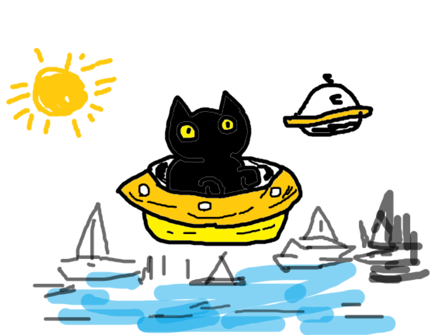

# Multimodal LLM Evaluation
## Qwen3-VL と OpenAI による画像理解性能の比較

ローカル環境で動作する **Qwen3-VL** と、クラウドAPIで利用する **OpenAIのマルチモーダルモデル** に対して、同一画像・同一プロンプトを入力し、画像理解性能の違いを比較した検証プロジェクトです。

単純にモデルの回答文を見比べるだけではなく、

- Ground Truthの事前作成
- 同一条件での画像推論
- LLM-as-a-Judgeによる一次評価
- 人間による評価結果のレビュー
- Ground TruthのAtomic Factへの正規化
- `MATCH / PARTIAL / MISS` による最終分類
- Strict Precision / Recall / F1-scoreによる定量評価
- Ground Truthを設定しない定性比較

までを一連の評価パイプラインとして構築しました。

本プロジェクトでは、**モデルそのものの比較だけでなく、マルチモーダルLLMをどのように評価するか**についても検証対象としています。

---

## 1. 検証目的

本検証の目的は、各モデルを個別にチューニングして最大性能を引き出すことではありません。

> **同一画像・同一プロンプトを使用し、モデル以外の条件を可能な限り揃えた状態で画像理解結果を比較すること**

を目的としています。

モデルごとに異なるプロンプト最適化や追加チューニングを行った場合、結果の差が、

- モデル自体の性能差
- プロンプト設計の差
- モデル固有のチューニング差

のどこから生じたのか判断しにくくなります。

そのため本検証では、両モデルに同じ画像と同じプロンプトを入力し、個別の追加調整は原則として行っていません。

したがって、本検証で比較しているのは、

> **各モデルを最大限最適化した場合の性能ではなく、同一条件下で使用した場合の画像理解特性の違い**

です。

誤認、見落とし、部分的な認識についても修正せず、そのまま評価対象としました。

---

## 2. 評価方針

本検証では、モデル回答全体に対して単純に「正解・不正解」を付ける方法は採用していません。

画像説明には複数の事実が含まれるため、回答全体を1つの単位として評価すると、

- 一部だけ正しい回答
- 対象は正しいが数量が違う回答
- 大意は合っているが種類が異なる回答
- 正しい情報と誤った情報が混在する回答

などを適切に評価することが難しくなるためです。

そこで、画像内の事実を小さな単位である **Atomic Fact** に分解し、それぞれについて評価しました。

評価は最終的に以下の3種類へ分類しています。

```text
MATCH
PARTIAL
MISS
```

また、モデルがGround Truth以外の情報を追加した場合には、

```text
unsupported
unverified
```

として別途管理しています。

---

## 3. 評価結果

定量評価には5枚の画像から作成した **47個のAtomic Fact** を使用しました。

| Model | MATCH | PARTIAL | MISS | Strict Precision | Strict Recall | Strict F1 |
| --- | ---: | ---: | ---: | ---: | ---: | ---: |
| Qwen3-VL | 57.4% | 25.5% | 17.0% | 0.659 | 0.574 | 0.614 |
| OpenAI | 74.5% | 12.8% | 12.8% | 0.833 | 0.745 | 0.787 |

本評価セットでは、OpenAIがPrecision、Recall、F1-scoreのすべてで高い結果となりました。

一方、Qwen3-VLでは `MISS` より `PARTIAL` の割合が高く、

> **対象や場面そのものは認識しているものの、数量・種類・属性・位置関係などの詳細が不足する**

ケースが比較的多く確認されました。

これは完全に認識できていないケースだけでなく、**大意は捉えているが細部に差が生じる傾向**が存在したことを示しています。

なお、本評価は5枚・47 Atomic Factsという小規模な独自評価セットによるものです。

したがって、この数値をQwen3-VLやOpenAIモデル全般の性能を示すベンチマーク値として解釈することはできません。

---

## 4. 評価画像

定量評価には `001.png` ～ `005.png` の5枚を使用しました。

複数の画像理解能力を確認するため、以下の要素を含む画像を用意しています。

- 複数物体の認識
- 数量の認識
- 物体同士の位置関係
- 背景の理解
- OCR
- 画像全体の意味・種類

本検証で使用した画像は、すべて本プロジェクト用に自身で用意しています。

- `001.png` ～ `005.png`
  - 自身で作成した手描き画像
- `000.png`
  - 自身で構築・調整したStable Diffusion環境で生成した画像

外部サイトや第三者の公開画像を評価データとして転載していません。

### 定量評価画像の例：001.png



`001.png` では、

- 猫
- UFO
- ヨット
- 太陽
- 海
- 物体同士の位置関係

などを評価しています。

例えばQwen3-VLでは、Ground Truth上の **「UFO」** を **「宇宙船」** と表現しました。

飛行物体としての大意は捉えている一方、Ground Truthで要求した具体的な種類とは一致していないため、このケースは `PARTIAL` としています。

---

### 定性比較画像：000.png


`000.png` は、定量評価用の手描き画像とは異なる通常の生成イラストです。

この画像にはGround Truthを設定せず、自然なイラストに対して両モデルがどのような説明を生成するかを見る **定性評価** に使用しました。

この画像はPrecision / Recall / F1-scoreには含めていません。

---

## 5. 使用モデル

### Qwen3-VL

- Model: `Qwen/Qwen3-VL-4B-Instruct`
- ローカル環境で実行
- Hugging Face Transformersを使用

### OpenAI

- Model: `gpt-5.6-terra`
- OpenAI API経由で実行

### Judge LLM

- Model: `gpt-5.6-sol`

Judge LLMは評価画像そのものを見るのではなく、

- 事前に作成したGround Truth
- Qwen3-VLの固定済み回答
- OpenAIの固定済み回答

を比較します。

Judge LLMは最終スコアを決定する役割ではなく、**意味的な一致・差異を整理する一次評価**として使用しました。

---

## 6. 共通プロンプト

Qwen3-VLとOpenAIには、同一の評価プロンプトを入力しています。

確認項目は以下の5項目です。

1. 主な対象
2. 対象同士の関係・配置
3. 背景・周囲
4. 画像内の文字
5. 画像全体の意味・種類

Ground Truthは画像理解モデルには与えていません。

モデルは画像と共通プロンプトのみから回答を生成します。

---

## 7. Ground Truth

Ground Truthは、モデル回答を評価するための基準として使用します。

重要なのは、

> **Ground Truthをモデル出力を確認する前に作成・固定していること**

です。

モデル回答を確認した後でGround Truthを変更すると、特定モデルの回答に評価基準が引きずられる可能性があります。

そのため、まず画像からGround Truthを作成し、その後に両モデルの画像推論を実行しました。

ただし、最初からすべてのGround TruthをAtomic Fact形式で記述したわけではありません。

モデル回答とJudge結果を確認した後、**評価単位の粒度を統一するためにGround Truthの内容を変更せずAtomic Factへ分解・正規化**しています。

つまり、

```text
Ground Truthそのもの
```

と、

```text
Ground Truthをどの粒度で評価するか
```

は分けて扱っています。

---

## 8. 評価フロー

本検証の評価フローは以下の通りです。

```text
Ground Truthを事前作成・固定
          │
          ▼
       評価画像
          │
     ┌────┴────┐
     │         │
 Qwen3-VL    OpenAI
     │         │
     └────┬────┘
          │
          ▼
   モデル回答をJSON保存
          │
          ▼
      Judge LLM
          │
          │
          │ Ground Truthとの
          │ 意味的一致・差異を分類
          ▼
    Judge結果をレビュー
          │
          │
          │ 判定の揺らぎ・
          │ 粒度・重複を確認
          ▼
 Ground TruthをAtomic Factへ正規化
          │
          ▼
各Atomic Factを最終判定
          │
          ├── MATCH
          ├── PARTIAL
          └── MISS
          │
          ▼
   TP / FP / FNへ変換
          │
          ▼
Strict Precision / Recall / F1
          │
          ▼
        最終比較
```

ここで重要なのは、**Judge LLMが直接F1-scoreを計算しているわけではない**ことです。

Judge LLMは意味比較を担当し、最終的な定量評価はAtomic Fact単位に整理した後で行っています。

---

## 9. LLM-as-a-Judgeによる一次評価

Judge LLMでは、Ground Truthとモデル回答を比較し、以下のカテゴリへ分類しました。

### Ground Truth側

#### `matched`

Ground Truthと十分一致している情報。

#### `partial`

Ground Truthの大意には近いものの、

- 数量
- 属性
- 種類
- 位置関係
- OCR結果

などの一部に差がある情報。

#### `missed`

Ground Truthに存在するものの、モデル回答では取得できていない情報。

---

### モデルが追加した情報

#### `unsupported`

Ground Truthまたは確認可能な内容と明確に矛盾する情報や、明確な誤認。

#### `unverified`

Ground Truthには記載されていないものの、Ground Truthだけでは正誤を確定できない追加情報。

---

Ground Truthは画像に含まれるすべての情報を完全に列挙したものではありません。

そのため、

> **Ground Truthに書かれていない = 誤り**

とはしていません。

明確な誤認である `unsupported` と、評価対象として正誤を確定できない `unverified` を分離しています。

---

## 10. なぜJudge LLMだけで評価を完結させなかったか

LLM-as-a-Judgeを使用することで、多数のGround Truthとモデル回答を意味的に比較できます。

一方、実際に評価したところ、Judge自身の判定にも揺らぎが確認されました。

例えば、

- 同じ事実が `partial` と `missed` の両方に含まれる
- 1つの事実が複数の評価単位に分割される
- `partial` と `missed` の境界が一定しない
- Ground Truthにない追加情報の扱いが一定しない

といったケースです。

そのため、Judge LLMの出力をそのまま最終スコアとして使用していません。

Judgeの結果を一次評価として利用した後、

> **Ground Truthと固定済みモデル回答を人間が再確認し、評価粒度と判定基準を統一する**

手順を追加しました。

本検証では、Judgeによる自動化と人間レビューを組み合わせることで、評価効率と一貫性の両方を確保することを目指しました。

---

## 11. レビュー例

| Model / Image | Ground Truth | 固定済みLLM出力 | 一致した点 | 差異 | 最終判定 |
| --- | --- | --- | --- | --- | --- |
| Qwen3-VL / 001.png | 黄色いUFOが描かれている | 黒い猫が黄色い宇宙船に乗っている | 黄色い飛行物体を認識 | 「UFO」を「宇宙船」と表現 | PARTIAL |
| Qwen3-VL / 002.png | 犬が小さな船の上に立っている | 犬はイルカを向いて立っている | 犬とイルカの存在・近接関係を認識 | 犬が船上にいることを認識していない | MISS |
| Qwen3-VL / 005.png | BUTTERFLYと表示されている | 「BUTTER FLY」 | 文字列の大部分を認識 | 不要な空白が入っている | PARTIAL |
| Qwen3-VL / 005.png | 物体検知結果を模した図である | 動物と人間のキャラクターを分類する図解 | 対象を識別する図という大意を認識 | 物体検知結果までは特定していない | PARTIAL |
| OpenAI / 002.png | 犬が小さな船の上に立っている | 子犬がイルカの背中付近に乗っている | 犬とイルカの近接関係を認識 | 犬の位置を誤認 | MISS |

全件のレビュー済みJudge結果は以下へ保存しています。

```text
results/judge_results_reviewed.json
```

---

## 12. Atomic Factへの正規化

回答全体や文章単位で評価すると、1つの項目に含まれる情報量によって評価結果が変化します。

例えば、

```text
黒猫が黄色いUFOに乗っており、右上には別のUFOがあり、
海には複数のヨットが浮かんでいる
```

という1文を1件として評価すると、

- 黒猫
- UFO
- 猫とUFOの関係
- 右上の別のUFO
- 海
- 複数のヨット

という複数の事実が1つにまとめられてしまいます。

そこでGround Truthを **Atomic Fact** に分解しました。

例えば `001.png` では、

```text
黒猫が描かれている
黄色いUFOが描かれている
黒猫が黄色いUFOに乗っている
右上に別のUFOがある
海が描かれている
海に複数のヨットが浮かんでいる
```

のように、1つの評価単位になるまで分解します。

5枚の評価画像から、合計 **47個のAtomic Fact** を定義しました。

各Atomic Factについて、

```text
MATCH
PARTIAL
MISS
```

のいずれか1つへ最終分類しています。

Atomic Factと最終評価結果は以下に保存しています。

```text
results/final_evaluation.json
```

---

## 13. MATCH / PARTIAL / MISS の意味

### MATCH

Ground TruthのAtomic Factを十分に取得できている状態です。

例：

```text
Ground Truth:
黒猫が描かれている

Model:
黒い猫がいる
```

この場合は `MATCH` とします。

---

### PARTIAL

Ground Truthの対象や大意は取得できているものの、完全には一致していない状態です。

例：

```text
Ground Truth:
黄色いUFOが描かれている

Model:
黄色い宇宙船が描かれている
```

飛行物体としての意味は近いため完全な `MISS` とはしません。

一方、Ground Truthで要求している「UFO」という具体性までは取得できていないため `MATCH` にもしません。

このような中間状態を区別するために `PARTIAL` を設けています。

---

### MISS

Ground TruthのAtomic Factを取得できていない状態、または重要な関係を誤認している状態です。

例：

```text
Ground Truth:
犬が小さな船の上に立っている

Model:
犬がイルカの背中に乗っている
```

犬そのものを認識していても、評価対象である「船の上に立っている」という関係を取得できていないため `MISS` とします。

---

## 14. Strict Precision / Recall / F1-score

本検証では一般的な二値分類をそのまま使用するのではなく、Atomic Fact評価をTP / FP / FNへ変換しています。

### Precision

```text
Precision = TP / (TP + FP)
```

モデルが正しいと判断できる情報を、どの程度正確に出力したかを表します。

### Recall

```text
Recall = TP / (TP + FN)
```

Ground Truthに存在する情報を、どの程度取得できたかを表します。

### F1-score

```text
F1 = 2 × Precision × Recall
     ─────────────────────
      Precision + Recall
```

または、

```text
F1 = 2TP / (2TP + FP + FN)
```

と表せます。

---

## 15. 本検証におけるStrict評価

本検証では、以下の独自マッピングを採用しています。

| 判定 | TP | FP | FN | 意味 |
| --- | ---: | ---: | ---: | --- |
| MATCH | 1 | 0 | 0 | Ground Truthを十分に取得 |
| PARTIAL | 0 | 1 | 1 | 関連情報は出したが完全には取得できていない |
| MISS | 0 | 0 | 1 | Ground Truthを取得できていない |
| unsupported | 0 | 1 | 0 | Ground Truthに対して誤った情報を追加 |
| unverified | 0 | 0 | 0 | 正誤を確定できないため除外 |

つまり、

```text
MATCH       → TP
PARTIAL     → FP + FN
MISS        → FN
unsupported → FP
unverified  → 評価対象外
```

としています。

これは一般的に決められたF1-scoreの分類方法ではなく、**本プロジェクト独自のStrict評価ルール**です。

---

## 16. なぜPARTIALを「FP + FN」としたか

`PARTIAL` は完全な誤答ではありません。

しかし、本検証ではF1-scoreを算出する際に、あえて完全正解としての加点を行っていません。

例えば、

```text
Ground Truth:
黄色いUFOが描かれている

Model:
黄色い宇宙船が描かれている
```

という場合、モデルは関連する物体を認識しています。

一方で、

1. Ground Truthで要求した「UFO」という事実を完全には取得できていない
2. 「宇宙船」というGround Truthとは異なる情報を出力している

という2つの側面があります。

そこでStrict評価では、

```text
Ground Truthを完全には回収できなかった
        ↓
       FN

完全一致しない情報を出力した
        ↓
       FP
```

として扱います。

そのため、

```text
PARTIAL → FP + FN
```

としています。

### PARTIALを0.5点にしなかった理由

PARTIALについて、

```text
0.5 TP
```

のような部分点を与える方法も考えられます。

しかし、

```text
なぜ0.5なのか
なぜ0.3や0.7ではないのか
```

という別の恣意性が発生します。

また、

- 対象だけ合っている
- 数だけ違う
- 種類だけ違う
- 位置関係だけ違う

といった様々なPARTIALに同じ0.5を与えることにも判断が必要になります。

そこで本検証では、

> **定性評価ではPARTIALとして「ある程度認識できた」ことを残しつつ、定量評価では完全一致したAtomic Factのみを正解とする**

というStrict評価を採用しました。

これにより、

```text
MATCH率
PARTIAL率
MISS率
Strict F1
```

を組み合わせて確認できます。

F1-scoreだけでは失われる「惜しい回答」の情報は、PARTIAL率と実際のモデル回答から確認する設計です。

---

## 17. Strict F1-scoreの計算例

Qwen3-VLでは、

```text
MATCH       = 27
PARTIAL     = 12
MISS        = 8
unsupported = 2
```

でした。

Strict評価では、

```text
TP = MATCH
   = 27
```

```text
FP = PARTIAL + unsupported
   = 12 + 2
   = 14
```

```text
FN = PARTIAL + MISS
   = 12 + 8
   = 20
```

となります。

したがって、

```text
Precision
= 27 / (27 + 14)
= 27 / 41
≒ 0.659
```

```text
Recall
= 27 / (27 + 20)
= 27 / 47
≒ 0.574
```

```text
F1
= 2 × 0.659 × 0.574
  ─────────────────
      0.659 + 0.574

≒ 0.614
```

となります。

Recallの分母が47となることからも分かるように、Strict Recallでは **47個すべてのAtomic Factのうち、完全にMATCHしたものがどれだけあったか** を厳しく評価しています。

---

## 18. なぜF1-scoreだけで比較しないのか

Strict評価では `PARTIAL` も誤りとして扱うため、モデルが「ある程度まで認識できていた」という情報はF1-scoreだけでは見えにくくなります。

そのため、本検証ではF1-scoreだけを見るのではなく、

- MATCH
- PARTIAL
- MISS
- unsupported
- 実際のモデル回答

を合わせて確認します。

例えばQwen3-VLでは、

```text
MATCH   : 57.4%
PARTIAL : 25.5%
MISS    : 17.0%
```

となりました。

Strict F1はOpenAIより低い一方、MISSよりPARTIALが多いことから、

> **完全に認識できなかったケースよりも、大意は認識できたものの細部が不足したケースが多かった**

と解釈できます。

このように、定量スコアと定性的な内容を組み合わせて評価することを重視しています。

---

## 19. Ground Truthなしの定性比較

`000.png` ではGround Truthを設定せず、自身のStable Diffusion環境で生成したイラストを両モデルへ入力しました。

両モデルとも、

- 黒髪の少女
- 制服
- 雨
- 電柱
- 文字なし
- イラスト

といった主要要素を認識しました。

Qwen3-VLは、

> 「雨の中の学校制服を着た少女の静かな瞬間」

と、画像の雰囲気を含めた説明を行いました。

一方OpenAIは、

> 「雨の日に屋外で座る学生を描いたアニメ風イラスト」

と、場面と画像種類を比較的明確に分類しました。

また、電柱の位置など、同一画像に対する構図解釈にも違いが見られました。

この画像はStrict F1-scoreには含めていません。

定量評価だけでは確認しにくい、

- 説明の仕方
- 画像全体の解釈
- 具体性
- 雰囲気の表現

などを確認する目的で使用しています。

結果は以下に保存しています。

```text
results/qualitative_000_results.json
```

---

## 20. 評価結果の保存

再現性と評価過程の追跡可能性を保つため、各段階の結果をJSONとして保存しています。

```text
results/
├── qwen_results.json
├── openai_results.json
├── judge_results_v2.json
├── judge_results_reviewed.json
├── final_evaluation.json
└── qualitative_000_results.json
```

| File | 内容 |
| --- | --- |
| `qwen_results.json` | Qwen3-VLによる画像認識結果 |
| `openai_results.json` | OpenAIによる画像認識結果 |
| `judge_results_v2.json` | Judge LLMによる一次評価 |
| `judge_results_reviewed.json` | Judge結果を人間がレビュー・補正したデータ |
| `final_evaluation.json` | Atomic Fact、最終ラベル、Strict Precision / Recall / F1 |
| `qualitative_000_results.json` | `000.png` の定性比較結果 |

元のJudge結果を上書きせず、

```text
judge_results_v2.json
```

と

```text
judge_results_reviewed.json
```

を分離して保存しています。

これにより、

```text
自動評価
    ↓
人間レビュー
    ↓
最終評価
```

という評価過程を追跡できます。

---

## 21. ディレクトリ構成

```text
multimodal-llm-evaluation/
│
├── README.md
├── 05_Qwen3-VLとOpenAIによる画像理解比較.ipynb
├── ground_truth.json
│
├── images/
│   ├── 000.png
│   ├── 001.png
│   ├── 002.png
│   ├── 003.png
│   ├── 004.png
│   └── 005.png
│
└── results/
    ├── qwen_results.json
    ├── openai_results.json
    ├── judge_results_v2.json
    ├── judge_results_reviewed.json
    ├── final_evaluation.json
    └── qualitative_000_results.json
```

---

## 22. 実行環境

### ハードウェア・OS

- Windows
- NVIDIA GeForce RTX 4070 12GB
- CUDA 12.6系

### Python環境

- Anaconda
- conda environment: `model_compare`
- Jupyter Notebook

### 主なライブラリ

- PyTorch `2.14.0+cu126`
- Transformers `4.57.6`
- Pillow
- OpenAI Python SDK
- Pydantic
- Matplotlib

---

## 23. 公開用Notebook

公開用Notebookでは、以下の処理を再実行しません。

- Qwen3-VLによる画像推論
- OpenAI APIによる画像推論
- Judge LLM APIによる評価

一度取得した推論結果をJSONへ保存し、公開用Notebookでは保存済みデータを読み込んで、

- 評価画像
- モデル回答
- Judge結果
- レビュー例
- Atomic Fact評価
- Strict Precision / Recall / F1-score
- グラフ
- 定性比較

を再構成します。

これにより、画像と保存済みJSONが存在すれば、APIコストを発生させずに `Run All` が可能です。

また、モデル出力を固定することで、後から評価方法を変更した場合にも、**同じモデル回答に対して評価方法だけを再検証できる**構成としています。

---

## 24. 本検証の制約

本検証は大規模なベンチマークではありません。

定量評価画像は5枚、Atomic Factは47件であるため、今回算出したStrict F1-scoreを各モデルの一般的な性能値として解釈することはできません。

あくまで、

> **本プロジェクトで作成した評価セットにおける比較結果**

です。

また、Judge LLMにはOpenAI系モデルを使用しています。

そのため、OpenAIモデルの回答を評価する際に、同一ベンダーのモデルであることがJudgeの評価へ影響する可能性を完全には排除できません。

この問題に対して、

- Judge結果をそのまま最終評価にしない
- Ground Truthを事前に固定する
- モデル回答を固定する
- 人間によるレビューを行う
- Atomic Fact単位へ正規化する
- 生のJudge結果を保存する
- レビュー済み結果を別ファイルへ保存する

という手順を採用しました。

また、Qwen3-VLはローカルGPU、OpenAIはクラウドAPIで実行しています。

実行環境が異なるため、処理時間についてはモデル性能を直接比較する指標として使用していません。

---

## 25. 今後の改善案

より大規模な評価を行う場合は、以下の改善が考えられます。

- 評価画像数の増加
- Atomic Fact数の増加
- OCR、数量認識、位置関係などカテゴリ別評価
- 複数Judgeモデルによる評価
- 複数人による人間レビュー
- Judge間一致率の測定
- Strict評価とSoft評価の併記
- 他のローカルマルチモーダルモデルとの比較

特にPARTIALについては、本検証ではStrict評価として `FP + FN` としていますが、用途によっては、

```text
MATCH   = 1.0
PARTIAL = 0.5
MISS    = 0.0
```

などのSoft評価を併記する方法も考えられます。

ただし、その場合にはPARTIALへ与える重み自体の妥当性を別途定義する必要があります。

---

## 26. まとめ

本プロジェクトでは、Qwen3-VLとOpenAIの画像理解能力を同一条件で比較しました。

評価は、

```text
Ground Truthを事前固定
        ↓
同一画像・同一プロンプトで推論
        ↓
モデル回答を固定
        ↓
LLM-as-a-Judge
        ↓
人間によるレビュー
        ↓
Atomic Factへの正規化
        ↓
MATCH / PARTIAL / MISS
        ↓
Strict Precision / Recall / F1
        ↓
定量・定性の両面から比較
```

というパイプラインで実施しました。

本評価セットでは、OpenAIモデルのStrict F1-scoreがQwen3-VLを上回りました。

一方、Qwen3-VLについても多くのケースで対象や場面の大意を捉えており、完全な `MISS` よりも `PARTIAL` が多く確認されました。

また、評価側についても、LLM-as-a-Judgeだけでは判定粒度に揺らぎが生じることが確認できました。

そのため本検証では、

> **モデルの評価をさらに別のLLMへ完全に委任するのではなく、評価単位を明確化し、人間レビューを含めて評価基準を固定すること**

が重要であると考えました。

マルチモーダルLLMを比較する際には、単一のF1-scoreだけで優劣を判断するのではなく、

- 何を正解としているか
- どの粒度で評価しているか
- PARTIALをどう扱うか
- 誤認と見落としをどう区別するか
- 実際にどのような回答を生成したか

まで含めて確認することが重要です。
